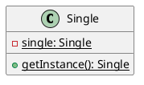

# 🎨 设计模式UML类图指南

本目录包含了23种设计模式的PlantUML类图，可以帮助你更好地理解设计模式的结构和关系。

## 📁 文件列表

- `creational-patterns.puml` - 创建型模式（5种）
- `structural-patterns.puml` - 结构型模式（7种）
- `behavioral-patterns-1.puml` - 行为型模式第1部分（6种）
- `behavioral-patterns-2.puml` - 行为型模式第2部分（5种）

## 📖 如何查看UML图

### 方式1：使用在线工具
1. 访问 [PlantUML在线编辑器](http://www.plantuml.com/plantuml/uml/)
2. 复制`.puml`文件内容
3. 粘贴到编辑器中
4. 查看生成的UML图

### 方式2：使用VS Code插件
1. 安装插件：`PlantUML`
2. 打开`.puml`文件
3. 按`Alt + D`预览

### 方式3：使用IDEA插件
1. 安装插件：`PlantUML integration`
2. 打开`.puml`文件
3. 右键选择 `Show PlantUML Diagram`

### 方式4：命令行生成图片
```bash
# 安装PlantUML
brew install plantuml  # macOS
# 或
apt-get install plantuml  # Ubuntu

# 生成PNG图片
plantuml docs/uml/creational-patterns.puml

# 生成SVG图片
plantuml -tsvg docs/uml/structural-patterns.puml

# 批量生成所有图片
plantuml docs/uml/*.puml
```

## 🎯 UML类图说明

### 创建型模式（5种）

#### 1. 单例模式 (Singleton)
```
Single
├── - {static} single: Single
├── - Single()
└── + {static} getInstance(): Single
```
**关键**：私有构造函数 + 静态实例 + 静态获取方法

#### 2. 工厂方法模式 (Factory Method)
```
SimpleFactory --> Shape
                   ├── Circle
                   └── Rectangle
```
**关键**：工厂类负责创建产品

#### 3. 抽象工厂模式 (Abstract Factory)
```
ProductAbstractFactory
├── CarFactory --> Car
└── BicycleFactory --> Bicycle
```
**关键**：产品族的概念

#### 4. 建造者模式 (Builder)
```
UserBuilder --> User
```
**关键**：链式调用，分步构建

#### 5. 原型模式 (Prototype)
```
UserPrototype implements Cloneable
└── clone(): Object
```
**关键**：实现Cloneable接口

---

### 结构型模式（7种）

#### 6. 适配器模式 (Adapter)
```
MediaPlayer <-- MediaAdapter --> AdvancedMediaPlayer
                                   ├── VlcPlayer
                                   └── Mp4Player
```
**关键**：适配器持有被适配者，实现目标接口

#### 7. 桥接模式 (Bridge)
```
Shape --> DrawingAPI
├── Circle       ├── WindowsDrawingAPI
└── Rectangle    └── MacDrawingAPI
```
**关键**：抽象部分持有实现部分引用

#### 8. 组合模式 (Composite)
```
FileSystemComponent
├── File (叶子节点)
└── Folder (容器节点)
    └── children: List<FileSystemComponent>
```
**关键**：统一叶子和容器接口，递归结构

#### 9. 装饰模式 (Decorator)
```
Coffee <-- CoffeeDecorator --> Coffee
           ├── MilkDecorator
           └── SugarDecorator
```
**关键**：装饰器持有被装饰对象，实现相同接口

#### 10. 外观模式 (Facade)
```
HomeTheaterFacade
├── amplifier: Amplifier
├── dvdPlayer: DVDPlayer
└── projector: Projector
```
**关键**：外观持有所有子系统引用

#### 11. 享元模式 (Flyweight)
```
CharacterFactory --> CharacterFlyweight
└── flyweightPool: Map
```
**关键**：工厂管理享元池，共享对象

#### 12. 代理模式 (Proxy)
```
Image <-- ImageProxy --> RealImage
```
**关键**：代理和真实对象实现相同接口

---

### 行为型模式（11种）

#### 13. 责任链模式 (Chain of Responsibility)
```
ApprovalHandler --> ApprovalHandler (next)
├── TeamLeaderHandler
├── DepartmentManagerHandler
└── GeneralManagerHandler
```
**关键**：每个处理器持有下一个处理器引用

#### 14. 命令模式 (Command)
```
Command
├── LightOnCommand --> Light
└── LightOffCommand --> Light

RemoteControl --> Command[]
```
**关键**：命令对象持有接收者引用

#### 15. 解释器模式 (Interpreter)
```
Expression
├── NumberExpression (终结符)
├── VariableExpression (终结符)
└── AddExpression (非终结符)
    ├── left: Expression
    └── right: Expression
```
**关键**：抽象语法树结构

#### 16. 迭代器模式 (Iterator)
```
Aggregate --> Iterator
BreakfastMenu --> BreakfastMenuIterator
```
**关键**：聚合对象创建迭代器

#### 17. 中介者模式 (Mediator)
```
ChatRoomMediator <--> User
ChatRoom              ├── RegularUser
                      └── VIPUser
```
**关键**：中介者协调同事对象

#### 18. 备忘录模式 (Memento)
```
TextEditor --> TextMemento
History --> TextMemento
```
**关键**：原发器创建备忘录，负责人管理备忘录

#### 19. 观察者模式 (Observer)
```
Subject --> Observer[]
WeatherData --> CurrentConditionsDisplay
            --> StatisticsDisplay
            --> ForecastDisplay
```
**关键**：主题维护观察者列表

#### 20. 状态模式 (State)
```
OrderContext --> OrderState
                 ├── PendingPaymentState
                 ├── PaidState
                 └── ShippedState
```
**关键**：上下文持有当前状态

#### 21. 策略模式 (Strategy)
```
Role --> IAttackBehavior
     --> IDefendBehavior
```
**关键**：上下文持有策略引用

#### 22. 模板方法模式 (Template Method)
```
Worker (abstract)
├── ITWorker
├── HRWorker
└── QAWorker
```
**关键**：父类定义骨架，子类实现细节

#### 23. 访问者模式 (Visitor)
```
Visitor               Employee
├── SalaryCalculator  ├── Engineer
└── PerformanceEvaluator ├── Manager
                      └── CEO
```
**关键**：双分派机制

---

## UML图例说明

### 关系符号

| 符号 | 含义 | PlantUML语法 |
|------|------|--------------|
| `<\|--` | 继承/实现 | `B extends A` 或 `B implements A` |
| `*--` | 组合 | `A *-- B` (A包含B，B不能独立存在) |
| `o--` | 聚合 | `A o-- B` (A包含B，B可以独立存在) |
| `-->` | 依赖 | `A --> B` (A依赖B) |
| `..>` | 虚线依赖 | `A ..> B` (A创建或使用B) |

### 可见性符号

| 符号 | 含义 |
|------|------|
| `+` | public |
| `-` | private |
| `#` | protected |
| `~` | package |

### 成员类型

| 符号 | 含义 |
|------|------|
| `{static}` | 静态成员 |
| `{abstract}` | 抽象成员 |
| `underline` | 静态成员（下划线） |
| `italic` | 抽象成员（斜体） |

---

## 设计模式UML对比

### 相似模式的UML结构对比

#### 装饰模式 vs 代理模式
```
装饰模式：
Coffee <-- CoffeeDecorator --> Coffee
          (可以多层嵌套)

代理模式：
Image <-- ImageProxy --> RealImage
         (通常单层)
```

#### 策略模式 vs 状态模式
```
策略模式：
Context --> Strategy (可以自由切换)

状态模式：
Context --> State (按规则转换)
```

#### 组合模式 vs 装饰模式
```
组合模式：
Component
├── Leaf
└── Composite --> Component[] (树形结构)

装饰模式：
Component <-- Decorator --> Component (链式结构)
```

---

## 常见UML模式

### 模式1：接口 + 实现
```
<<interface>> A
      ↑
      |
   ConcreteA
```
**使用场景**：策略、状态、命令等

### 模式2：抽象类 + 子类
```
AbstractClass
      ↑
      |
   ConcreteClass
```
**使用场景**：模板方法、工厂方法等

### 模式3：持有引用
```
ClassA --> ClassB
```
**使用场景**：装饰、代理、适配器等

### 模式4：递归结构
```
Component --> Component
```
**使用场景**：组合、责任链等

---

## 生成UML图片示例

### 生成PNG图片
```bash
cd docs/uml
plantuml creational-patterns.puml
plantuml structural-patterns.puml
plantuml behavioral-patterns-1.puml
plantuml behavioral-patterns-2.puml
```

### 生成SVG矢量图
```bash
plantuml -tsvg *.puml
```

### 批量生成所有格式
```bash
# PNG
plantuml -tpng *.puml

# SVG
plantuml -tsvg *.puml

# PDF
plantuml -tpdf *.puml
```

生成的图片会保存在同一目录下。

---

## 在Markdown中引用UML图

### 方式1：引用生成的图片
```markdown

```

### 方式2：使用PlantUML服务器
```markdown

```

### 方式3：内嵌PlantUML代码
在支持PlantUML的Markdown编辑器中直接写：
````markdown

````

---

## 学习建议

### 1. 从UML图理解模式
- 先看UML图，理解类之间的关系
- 识别关键的类和接口
- 理解依赖、关联、组合等关系

### 2. UML图与代码对应
- UML图中的每个类对应一个Java文件
- 关系箭头对应代码中的引用或继承
- 方法签名对应实际的方法定义

### 3. 通过UML图记忆模式
- UML图是模式的可视化表示
- 记住关键的结构和关系
- 画出UML图就能写出代码

---

## 快速参考

### 创建型模式核心结构
- **单例**：一个类
- **工厂**：工厂类 + 产品接口
- **抽象工厂**：工厂接口 + 产品族
- **建造者**：建造者类 + 产品类
- **原型**：实现Cloneable的类

### 结构型模式核心结构
- **适配器**：适配器持有被适配者
- **桥接**：抽象持有实现
- **组合**：容器持有组件列表
- **装饰**：装饰器持有被装饰对象
- **外观**：外观持有所有子系统
- **享元**：工厂管理享元池
- **代理**：代理持有真实对象

### 行为型模式核心结构
- **责任链**：处理器持有下一个处理器
- **命令**：命令持有接收者
- **解释器**：表达式树形结构
- **迭代器**：聚合创建迭代器
- **中介者**：中介者协调同事对象
- **备忘录**：原发器创建备忘录
- **观察者**：主题持有观察者列表
- **状态**：上下文持有当前状态
- **策略**：上下文持有策略
- **模板方法**：抽象类定义骨架
- **访问者**：访问者访问元素

---

## PlantUML语法快速参考

### 基本类定义
```plantuml
class ClassName {
    - privateField: Type
    # protectedField: Type
    + publicField: Type
    ~ packageField: Type
    + method(): ReturnType
    + {static} staticMethod(): Type
    + {abstract} abstractMethod(): Type
}
```

### 接口定义
```plantuml
interface InterfaceName {
    + method1(): void
    + method2(): Type
}
```

### 抽象类
```plantuml
abstract class AbstractClass {
    + {abstract} abstractMethod(): void
    + concreteMethod(): void
}
```

### 关系
```plantuml
' 继承
Child --|> Parent

' 实现
Class ..|> Interface

' 组合（强关联）
Whole *-- Part

' 聚合（弱关联）
Container o-- Element

' 关联
ClassA --> ClassB

' 依赖
ClassA ..> ClassB
```

### 注释
```plantuml
note left of ClassName
    这是一个注释
end note

note right of ClassName : 单行注释

note "浮动注释" as N1
```

---

## 进阶技巧

### 1. 包组织
```plantuml
package "包名" {
    class ClassA
    class ClassB
}
```

### 2. 隐藏成员
```plantuml
hide empty members
hide circle
```

### 3. 设置样式
```plantuml
skinparam classAttributeIconSize 0
skinparam class {
    BackgroundColor PaleGreen
    ArrowColor SeaGreen
    BorderColor SpringGreen
}
```

### 4. 布局方向
```plantuml
left to right direction
' 或
top to bottom direction
```

---

## 导出图片脚本

创建一个自动生成所有UML图的脚本：

### generate-uml.sh
```bash
#!/bin/bash

echo "🎨 开始生成UML类图..."

cd docs/uml

# 生成PNG格式
echo "📷 生成PNG格式..."
plantuml -tpng *.puml

# 生成SVG格式
echo "🖼️ 生成SVG格式..."
plantuml -tsvg *.puml

echo "✅ UML类图生成完成！"
echo "📁 PNG图片: docs/uml/*.png"
echo "📁 SVG图片: docs/uml/*.svg"
```

### 使用方法
```bash
chmod +x generate-uml.sh
./generate-uml.sh
```

---

## 参考资源

### PlantUML官方文档
- [PlantUML官网](https://plantuml.com/)
- [PlantUML类图语法](https://plantuml.com/zh/class-diagram)

### 在线工具
- [PlantUML在线编辑器](http://www.plantuml.com/plantuml/uml/)
- [PlantText](https://www.planttext.com/)

### IDE插件
- VS Code: PlantUML
- IntelliJ IDEA: PlantUML integration
- Eclipse: PlantUML Plugin

---

## 贡献

如果发现UML图有错误或需要改进，欢迎提交Issue或PR！

---

**💡 提示**: UML类图是理解设计模式的重要工具，建议配合代码一起学习！

