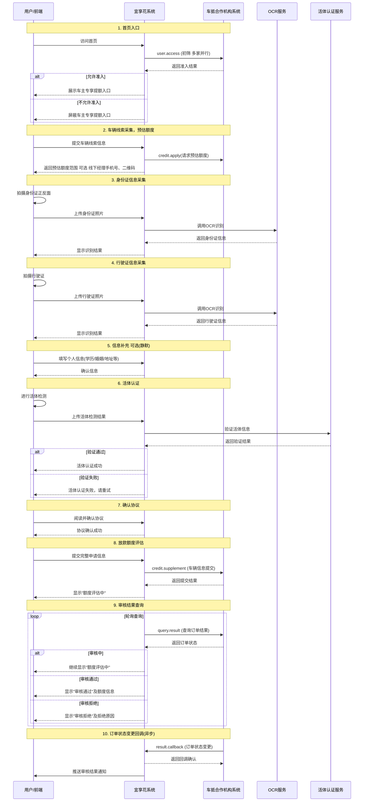

# 接口调用时序图

## 暂无

### 源码

```mermaid

sequenceDiagram
    participant 用户 as 用户/前端
    participant 宜享花 as 宜享花系统
    participant 机构 as 车抵合作机构系统
    participant OCR as OCR服务
    participant 活体 as 活体认证服务

    Note over 用户,机构: 1. 首页入口
    用户->>宜享花: 访问首页
    宜享花->>机构: user.access (初筛 多家并行)
    机构-->>宜享花: 返回准入结果
    alt 允许准入
        宜享花-->>用户: 展示车主专享提额入口
    else 不允许准入
        宜享花-->>用户: 屏蔽车主专享提额入口
    end

    Note over 用户,机构: 2. 车辆线索采集，预估额度
    用户->>宜享花: 提交车辆线索信息
    宜享花->>机构: credit.apply(请求预估额度)
    宜享花-->>用户: 返回预估额度范围 可选 线下经理手机号、二维码

    Note over 用户,机构: 3. 身份证信息采集
    用户->>用户: 拍摄身份证正反面
    用户->>宜享花: 上传身份证照片
    宜享花->>OCR: 调用OCR识别
    OCR-->>宜享花: 返回身份证信息
    宜享花-->>用户: 显示识别结果

    Note over 用户,机构: 4. 行驶证信息采集
    用户->>用户: 拍摄行驶证
    用户->>宜享花: 上传行驶证照片
    宜享花->>OCR: 调用OCR识别
    OCR-->>宜享花: 返回行驶证信息
    宜享花-->>用户: 显示识别结果

    Note over 用户,机构: 5. 信息补充 可选(静默)
    用户->>宜享花: 填写个人信息(学历/婚姻/地址等)
    宜享花-->>用户: 确认信息

    Note over 用户,机构: 6. 活体认证
    用户->>用户: 进行活体检测
    用户->>宜享花: 上传活体检测结果
    宜享花->>活体: 验证活体信息
    活体-->>宜享花: 返回验证结果
    alt 验证通过
        宜享花-->>用户: 活体认证成功
    else 验证失败
        宜享花-->>用户: 活体认证失败，请重试
    end

    Note over 用户,机构: 7. 确认协议
    用户->>宜享花: 阅读并确认协议
    宜享花-->>用户: 协议确认成功


    Note over 用户,机构: 8. 放款额度评估
    用户->>宜享花: 提交完整申请信息
    宜享花->>机构: credit.supplement (车辆信息提交)
    机构-->>宜享花: 返回提交结果
    宜享花-->>用户: 显示"额度评估中"

    Note over 用户,机构: 9. 审核结果查询
    loop 轮询查询
        宜享花->>机构: query.result (查询订单结果)
        机构-->>宜享花: 返回订单状态
        alt 审核中
            宜享花-->>用户: 继续显示"额度评估中"
        else 审核通过
            宜享花-->>用户: 显示"审核通过"及额度信息
        else 审核拒绝
            宜享花-->>用户: 显示"审核拒绝"及拒绝原因
        end
    end

    Note over 用户,机构: 10. 订单状态变更回调(异步)
    机构->>宜享花: result.callback (订单状态变更)
    宜享花-->>机构: 返回回调确认
    宜享花->>用户: 推送审核结果通知
```
